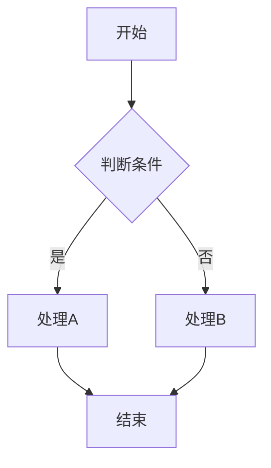
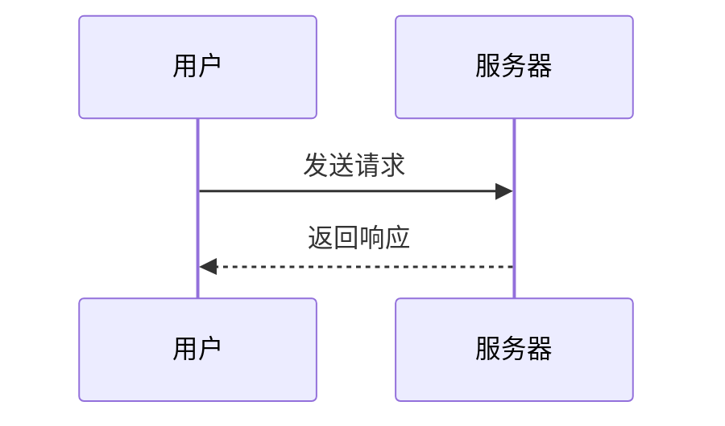
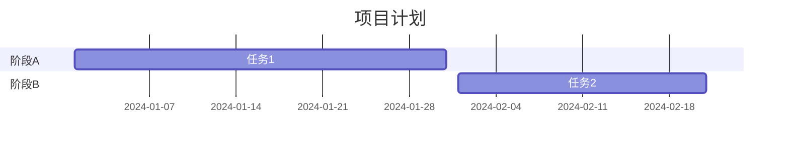

## 软件简介

MarkText 是一款基于 MIT 许可证的**开源**、**跨平台** Markdown 编辑器，采用所见即所得（WYSIWYG）编辑模式，被誉为 Typora 的最佳免费替代品。它底层基于 Electron + Vue，核心渲染引擎支持 **CommonMark Spec** 和 **GitHub Flavored Markdown（GFM）** 规范。

与付费的 Typora 不同，MarkText 完全免费且开源，社区活跃度极高（GitHub 50k+ Stars），功能更新频繁。它特别适合需要频繁撰写技术文档、笔记、博客文章的用户。

## 核心特性

- **三种编辑模式**：Source Code 模式（纯源码编辑）、Typewriter 模式（打字机模式，光标始终居中）、Focus 模式（焦点行高亮，其余行半透明），点击右下角状态栏图标即可切换。
- **所见即所得**：输入即渲染，无需切换预览窗口。支持表格、图片、列表、代码块、公式的实时渲染。
- **数学公式**：基于 KaTeX 引擎，使用 `$$` 包裹块级公式，使用 `$` 包裹行内公式，渲染速度快于 MathJax。
- **代码高亮**：支持 190+ 编程语言的语法高亮，代码块指定语言后自动着色。
- **图表绘制**：原生支持 **Mermaid** 流程图、时序图、甘特图；**Flowchart.js** 流程图；**Sequence.js** 时序图。在代码块中指定语言即可。
- **主题系统**：内置亮色/暗色主题（Light/Dark），可从社区下载第三方主题（.css 文件），也支持自定义 CSS 主题。
- **导出格式**：支持导出为 HTML、PDF（借助 Chrome Headless）、纯文本、图片（PNG/JPEG）。
- **文件管理**：左侧 Sidebar 提供文件树浏览（Tree View），可展开/折叠目录结构，支持拖拽移动文件。

## 下载与安装

MarkText 支持 Windows、macOS、Linux 三大平台，以下是各平台的安装方式。

### Windows

**方式一：GitHub Releases（推荐）**
前往 [MarkText Releases 页面](https://github.com/marktext/marktext/releases)，下载最新版本的 `.exe` 或 `.msi` 安装包，双击运行按照向导完成安装。Release 页面通常提供 **MarkText-{version}-x64.exe**（普通安装包）和 **MarkText-{version}-x64.msi**（企业部署包）。

**方式二：winget**
在终端中执行：
```
winget install marktext
```
winget 会自动下载最新稳定版并完成安装。

**方式三：Chocolatey**
```
choco install marktext
```

### macOS

**方式一：GitHub Releases**
下载 `.dmg` 文件（如 `marktext-{version}-arm64.dmg` 或 `marktext-{version}-x64.dmg`），打开后将 MarkText 拖入 Applications 文件夹。

**方式二：Homebrew**
```
brew install --cask marktext
```
Homebrew Cask 会下载最新版本并自动安装到 Applications 目录。

### Linux

**AppImage（通用）**
下载 `.AppImage` 文件，赋予可执行权限后运行：
```
chmod +x MarkText-*-x86_64.AppImage
./MarkText-*-x86_64.AppImage
```

**Snap（Ubuntu/Debian）**
```
snap install marktext
```

**包管理器（各发行版）**
- Arch Linux（AUR）：`yay -S marktext-bin` 或 `yay -S marktext`（源码编译）
- Fedora / EPEL：`sudo dnf install marktext`
- 社区维护的 Flatpak：`flatpak install flathub com.github.marktext.marktext`

## 基本编辑操作

### 创建和打开文档

启动 MarkText 后，默认进入空白文档。可以通过菜单栏 `File > New File`（Ctrl+N）新建文件，或 `File > Open File`（Ctrl+O）打开已有的 `.md` 文件。MarkText 也支持直接拖拽 `.md` 文件到窗口打开。

### 文本格式化

使用工具栏按钮或快捷键进行格式化：

| 效果 | 快捷键 | Markdown 语法 |
|------|--------|---------------|
| 加粗 | Ctrl+B | `**文本**` |
| 斜体 | Ctrl+I | `*文本*` |
| 删除线 | Ctrl+Shift+X | `~~文本~~` |
| 高亮 | -- | `==文本==` |
| 超链接 | Ctrl+K | `[文字](URL)` |
| 行内代码 | Ctrl+Shift+` | `` `代码` `` |

### 段落与标题

- 输入 `#` ～ `######` 后按空格即可创建 1～6 级标题。
- 输入 `>` 后按空格创建引用块。
- 输入 `-`、`*` 或 `1. ` 后按空格创建无序或有序列表。
- 输入 `---` 或 `***` 创建水平分割线。

### 插入图片

MarkText 支持三种方式插入图片：
1. **拖拽**：直接从文件管理器拖入图片到编辑器。
2. **粘贴**：截图后直接 Ctrl+V 粘贴。
3. **工具栏**：点击工具栏图片图标，选择图片文件。

插入后右键图片可以调整对齐方式（左/中/右）和设置图片标题。MarkText 默认将图片复制到 `./media` 目录，也可在设置中修改图片存储路径。

### 插入表格

点击工具栏表格图标，弹出对话框设置行数和列数。也可以直接使用 Markdown 表格语法：
```
| 列1 | 列2 | 列3 |
|-----|-----|-----|
| 内容 | 内容 | 内容 |
```
在表格内按 Tab 键跳转到下一个单元格，按 Shift+Tab 回退。

### 插入链接

选中文字后按 Ctrl+K，在弹出对话框中输入 URL。也可以直接输入 Markdown 链接语法 `[显示文字](链接地址)`。MarkText 支持自动补全——输入 `[` 后会自动匹配已打开的文档标题。

## 数学公式编辑

MarkText 使用 **KaTeX** 作为数学公式渲染引擎（支持 LaTeX 语法）。

**行内公式**：使用单个 `$` 包裹，例如 `$E = mc^2$` 渲染为 E = mc²。

**块级公式**：使用双 `$$` 包裹，独占一行，例如：

```
$$
\sum_{i=1}^{n} i = \frac{n(n+1)}{2}
$$
$$

\hat{\mu} = \frac{1}{n}\sum_{i=1}^{n} x_i
$$
```

支持的常用 LaTeX 命令：`\frac{}` 分数、`\sqrt{}` 根号、`\int` 积分、`\sum` 求和、`\lim` 极限、`\alpha\beta\gamma` 希腊字母、`\begin{matrix}` 矩阵等。

**注意**：公式输入完后可能需要稍等片刻让 KaTeX 完成渲染。如果公式显示为纯文本，请检查是否缺少结束 `$` 或语法错误。

## 代码块与语法高亮

输入三个反引号 ````` ``` ```` 后按 Enter 或空格，MarkText 会弹出语言选择菜单。从列表中选择编程语言（支持 190+ 种），或者直接手动输入语言名称，例如：

````
```python
def fibonacci(n):
    if n <= 1:
        return n
    return fibonacci(n-1) + fibonacci(n-2)
```
````

支持的语言包括但不限于：JavaScript、TypeScript、Python、Java、Go、Rust、C/C++、C#、Ruby、PHP、Swift、Kotlin、SQL、Shell、YAML、JSON、XML、HTML、CSS。

代码块左上角会显示语言名称，右上角有复制按钮（一键复制代码内容）。在代码块内部，Tab 键输入缩进而非跳转。

## Mermaid 图表绘制

MarkText 原生支持 **Mermaid** 图表渲染。在代码块中将语言指定为 `mermaid` 即可。

**流程图（Flowchart）**：


**时序图（Sequence Diagram）**：


**甘特图（Gantt）**：


**类图（Class Diagram）**、**状态图（State Diagram）**、**饼图（Pie Chart）** 等也全部支持。

此外，MarkText 还支持 **Flowchart.js**（代码块语言指定为 `flowchart`）和 **Sequence.js**（代码块语言指定为 `sequence`），提供了额外的图表语法选择。

**提示**：如果在 MarkText 中 Mermaid 渲染异常，可以打开偏好设置，在 Markdown 选项下检查 Mermaid 渲染开关是否开启。Mermaid 图表的主题色会跟随 MarkText 的亮色/暗色主题自动切换。

## 主题与自定义

### 内置主题

MarkText 内置两套主题：
- **Light**：白色干净背景，适合白天使用。
- **Dark**：深色背景（深灰底色 + 绿色/蓝色高亮），适合夜间护眼。

切换方式：菜单栏 `View > Theme > Light/Dark`，或点击右上角菜单图标选择。

### 安装第三方主题

MarkText 社区提供了大量第三方主题：
1. 前往 [GitHub Discussions - Themes](https://github.com/marktext/marktext/discussions/categories/themes) 或 Github 上搜索 `marktext-theme`。
2. 下载 `.css` 文件。
3. 打开 MarkText，进入 `Preferences > Appearance`，点击 `Theme Folder` 打开主题目录。
4. 将下载的 `.css` 文件放入该目录。
5. 重启 MarkText，在 `View > Theme` 菜单中即可看到新主题。

### 自定义 CSS

在偏好设置 `Preferences > Appearance` 中，可以编辑自定义 CSS 片段，覆盖任意元素的样式。例如修改编辑器的最大宽度、字体大小、行高等。

## 偏好设置详解

打开 `File > Preferences`（Ctrl+,）进入偏好设置窗口，主要设置项如下：

### General（通用）
- **语言**：支持中文、英文等多语言界面。
- **自动保存**：开启后文档在内容变更时自动写入磁盘（默认关闭）。
- **自动恢复**：开启后 MarkText 崩溃重启时自动恢复未保存的内容。
- **启动时**：可设置为打开空白文档、上次关闭时的文档、或特定目录。

### Editor（编辑器）
- **字体**：设置编辑器的字体、字号、行高。
- **行宽**：限制最大行宽（推荐 42em～60em，更适合阅读）。
- **Tab 大小**：缩进宽度，推荐 2 或 4 空格。
- **行号**：在编辑器左侧显示行号。
- **自动配对**：自动补全括号、引号。
- **拼写检查**：内置拼写检查，支持多种语言词典。

### Markdown
- **数学公式**：开启/关闭 KaTeX 渲染。
- **Mermaid**：开启/关闭 Mermaid 图表渲染。
- **Front Matter**：开启/关闭 YAML front matter 渲染显示（默认关闭，开启后显示为信息卡片而非纯文本）。
- **超级订阅（Superscript）/ 下角标（Subscript）**：支持 `H~2~O` 和 `X^2^` 语法。

### Image（图片）
- **图片存储路径**：可选择当前文件夹 (`./assets`)，或指定绝对路径。
- **图片上传**：可配置第三方图床（如 GitHub 仓库、SM.MS、Imgur 等），粘贴后自动上传到图床并替换为在线链接。

## 导出文档

MarkText 支持将当前文档导出为多种格式，通过 `File > Export` 菜单访问：

- **HTML**：导出为完整的 HTML 文件，保留所有样式和渲染效果。
- **PDF**：导出为 PDF 文档（需要系统安装 Chrome/Chromium，MarkText 会调用 Chrome Headless 渲染引擎）。
- **图片**：导出为 PNG 或 JPEG 图片，适合分享到社交媒体。
- **纯文本**：去掉所有 Markdown 标记，只保留纯文本内容。

## 文件管理

左侧的 **Sidebar**（侧边栏，按 `Ctrl+Shift+E` 切换显示）提供两种视图：
- **File Tree（文件树）**：显示当前打开目录的完整文件结构，支持新建/删除/重命名/拖拽文件。
- **Outline（大纲）**：显示当前文档的标题层级结构，点击可快速跳转到对应章节。

如果没有打开任何目录，Sidebar 会显示"打开文件夹"按钮。MarkText 建议在一个项目目录下工作，这样文件管理功能最为完善。

## 与 Typora 的对比

| 对比项 | MarkText | Typora |
|--------|----------|--------|
| **价格** | 完全免费（MIT 开源） | 付费（$14.99/设备） |
| **编辑模式** | Source Code / Typewriter / Focus | Source Code / Focus / Typewriter |
| **图表支持** | Mermaid + Flowchart.js + Sequence.js | Mermaid |
| **图片上传** | 支持（图床配置） | 支持 |
| **平台** | Windows / macOS / Linux | Windows / macOS / Linux |
| **主题** | Light / Dark + 自定义 CSS | 6 款内置 + 自定义 |
| **更新频率** | 社区驱动，节奏稍慢 | 官方维护，更新稳定 |
| **GitHub Stars** | 50k+ | 不适用（闭源） |

**结论**：如果预算有限且需要 Mermaid 图表支持，MarkText 是比 Typora 更优的选择。如果你看重更精致的 UI 和更稳定的商业支持，Typora 仍然是好选择。

## 常见问题

### MarkText 打开大文件很慢怎么办？
MarkText 对超大文件（>10MB）的性能表现一般。如果遇到卡顿，可以尝试切换到 Source Code 模式（关闭实时渲染），或使用 VS Code / Notepad++ 编辑大文件。

### 如何让 MarkText 显示 YAML Front Matter？
在 `Preferences > Markdown` 中勾选 `Front Matter`，YAML 头部会以信息卡片形式渲染显示，而非纯文本。

### MarkText 能像 Typora 一样使用 Pandoc 导出吗？
MarkText 目前不直接集成 Pandoc。但你可以导出为 Markdown 源文件后，手动使用 Pandoc 转换为其他格式（如 docx、LaTeX、epub）。
